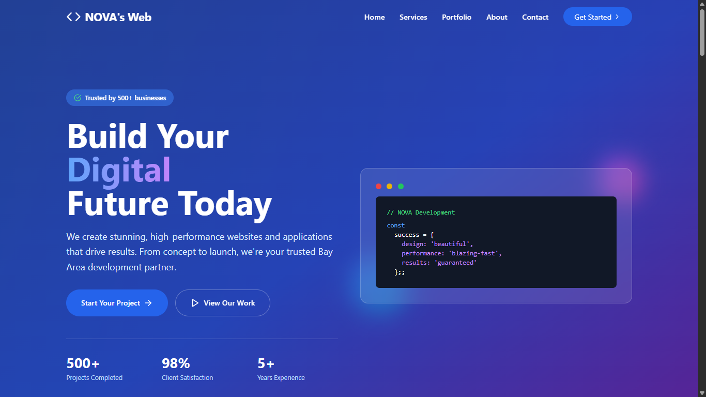

# 🚀 Ahmad Sahl — Personal Portfolio Website

<div align="center">



[](https://ahmadsp-web.vercel.app/)
[](./LICENSE)
[](https://developer.mozilla.org/en-US/docs/Web/HTML)
[](https://developer.mozilla.org/en-US/docs/Web/CSS)
[](https://developer.mozilla.org/en-US/docs/Web/JavaScript)

</div>

---

## 📌 About

A modern, fully responsive **personal portfolio website** built with vanilla HTML, CSS, and JavaScript — no frameworks, no build tools, just clean and performant code. Designed to showcase projects, skills, and experience as a **Data Analyst**, **Chatbot Developer**, and **Web Developer**.

---

## ✨ Features

- ⚡ **Fast loader** — dismisses on `DOMContentLoaded`, works even offline or via `file://`
- 🎨 **Animated particle background** with cursor glow effect
- ⌨️ **Typewriter effect** cycling through skills
- 📊 **Animated stat counters** on scroll
- 🃏 **Project lightbox** with tag filtering and 3D hover effect
- 📜 **Certificate lightbox** with "Show More" toggle
- 🗺️ **Interactive timeline** for education & work experience (switchable tabs)
- 📬 **Contact form** integrated with **Telegram Bot API**
- 📱 **Fully responsive** — mobile hamburger nav, fluid layouts
- 🌙 **Dark theme** with smooth scroll-reveal animations
- ♿ Keyboard accessible (Escape closes modals)

---

## 🛠️ Tech Stack

| Layer | Technology |
|---|---|
| Markup | HTML5 |
| Styling | CSS3 (custom properties, grid, flexbox, animations) |
| Logic | Vanilla JavaScript (ES6+) |
| Icons | Font Awesome 6 |
| Fonts | Google Fonts (Montserrat, Poppins, Nunito) |
| Notifications | Telegram Bot API |
| Deployment | Vercel / GitHub Pages |

---

## 📂 Project Structure

```
portfolio/
├── index.html              # Main HTML file
├── assets/
│   ├── CSS/
│   │   └── style.css       # All styles
│   ├── JS/
│   │   └── personal.js     # All scripts
│   ├── images/             # Project screenshots & profile photo
│   └── PDF/
│       └── Ahmad Sahl Pahlevi - CV.pdf
└── README.md
```

---

## 🚀 Getting Started

No build step required. Just clone and open.

```bash
git clone https://github.com/YOUR_USERNAME/YOUR_REPO.git
cd YOUR_REPO
# Open index.html in your browser
```

Or serve locally with:

```bash
npx serve .
# or
python -m http.server 8000
```

---

## ⚙️ Configuration

To enable the contact form, update the config object in `personal.js`:

```js
const CFG = {
    telegramUsername: "@YourBot",
    telegramBotToken: "YOUR_BOT_TOKEN",
    telegramChatId:   "YOUR_CHAT_ID",
};
```

> **Note:** Do not commit your real bot token to a public repository. Use environment variables or a backend proxy for production.

---

## 📬 Contact

| Platform | Link |
|---|---|
| 🌐 Portfolio | [ahmadsp-web.vercel.app](https://ahmadsp-web.vercel.app/) |
| 💼 LinkedIn | [linkedin.com/in/ahmad-sahl](https://linkedin.com/in/ahmad-sahl) |
| 📱 Telegram | [@ReportAntreanLM_bot](https://t.me/ReportAntreanLM_bot) |
| 📍 Location | Jakarta, Indonesia |

---

## 📄 License

This project is licensed under the **MIT License** — see the [LICENSE](./LICENSE) file for details.

---

<div align="center">
  Made with ❤️ by <strong>Ahmad Sahl Pahlevi</strong>
</div>
